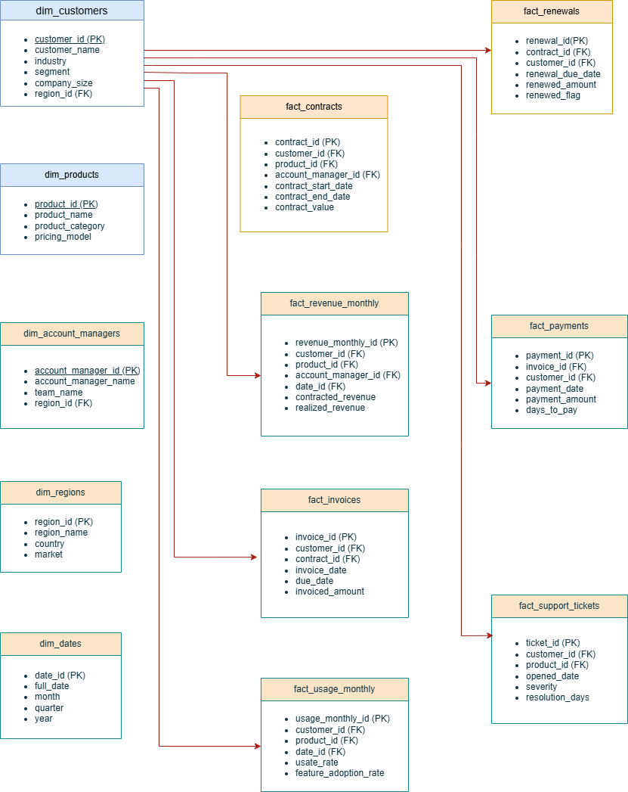

# Revenue Leakage & Retention Command Center

## Overview

The **Revenue Leakage & Retention Command Center** is an end-to-end Business Intelligence solution designed to help organizations identify hidden revenue loss and improve customer retention.

This project simulates a **real-world enterprise analytics product**, integrating data across finance, sales, and customer success to provide a unified view of revenue performance and risk.

---

## Business Problem

Mid-sized B2B organizations often experience **significant but invisible revenue leakage** despite stable top-line growth.

This leakage typically occurs through:
- Customer churn and contraction
- Excessive discounting
- Billing and collection inefficiencies
- Lack of early visibility into at-risk customers

These issues are often **fragmented across systems and teams**, making them difficult to detect and act on.

As a result, leadership lacks a **single source of truth for revenue health**, leading to delayed decisions and preventable losses.

---

## Solution

This project delivers a **decision-driven analytics platform** that:

- Identifies and quantifies revenue leakage drivers
- Detects early signals of customer churn risk
- Provides executive-level visibility into revenue health
- Enables proactive, data-driven decision making

The solution is built as a **multi-layer BI system**:

- Data modeling (PostgreSQL, star schema)
- KPI definition and transformation (SQL)
- Interactive dashboards (Tableau)
- Business documentation (GitHub case study)

---

## Key Capabilities

- Revenue Leakage Analysis (discounting, churn, billing gaps)
- Net Revenue Retention (NRR) tracking
- Customer Risk Segmentation (health scoring)
- Account Manager & Regional Performance insights
- Customer-level deep-dive analysis

---

## Architecture

The solution follows a **modern BI architecture**:

**Data Sources → SQL Transformation Layer → KPI Semantic Layer → Tableau Dashboards**

- Structured using a **star schema** for scalability and clarity
- Designed with **business-first, KPI-driven modeling**
- Optimized for executive and operational decision-making

📊 **Entity Relationship Diagram (ERD):**  


---

## Dashboard Design

The analytics experience is structured into five core views:

1. Executive Overview  
2. Revenue Leakage Analysis  
3. Customer Risk & Retention  
4. Account Manager / Region Performance  
5. Customer Drilldown  

Each dashboard is designed to answer:
- What is happening?
- Why is it happening?
- What action should be taken?

---

## Project Structure

```
revenue-leakage-retention-command-center/

├── README.md
├── /docs
│   ├── business_case.md
│   ├── stakeholder_requirements.md
│   ├── kpi_definitions.md
│   ├── data_model.md
│   ├── solution_design.md
│   ├── executive_summary.md
│
├── /sql
│   ├── schema.sql
│   ├── data_generation.sql
│   ├── kpi_views.sql
│
├── /tableau
│   ├── dashboards.twbx
│
├── /images
│   ├── erd.png
```

---

## Design Approach

This project was built using a **consulting-style methodology**:

- Business problem defined before technical implementation
- Stakeholder requirements captured upfront
- KPIs standardized and documented prior to development
- Data model designed to reflect real enterprise systems
- Dashboards structured around **decisions, not visuals**

---

## Current Status

🚧 **In Progress**

- ✅ Week 1: Business Definition & Solution Design  
- 🔜 Week 2: SQL Schema, Data Generation, KPI Layer  
- 🔜 Week 3: Tableau Dashboards & Final Presentation  

---

## What Makes This Project Different

Unlike typical portfolio projects, this solution:

- Focuses on **business impact**, not just data visualization  
- Simulates a **real enterprise environment**  
- Connects data to **financial outcomes and decisions**  
- Demonstrates **end-to-end ownership** (strategy → data → insights)

---

## Author

Built as a flagship portfolio project to demonstrate **advanced BI, analytics, and business strategy capabilities**.
